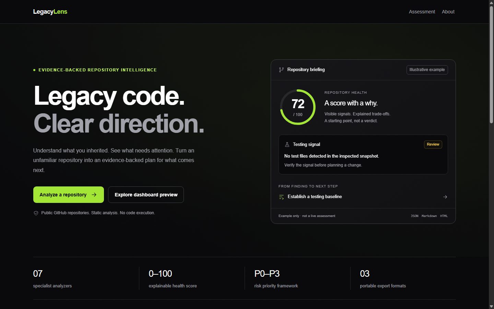
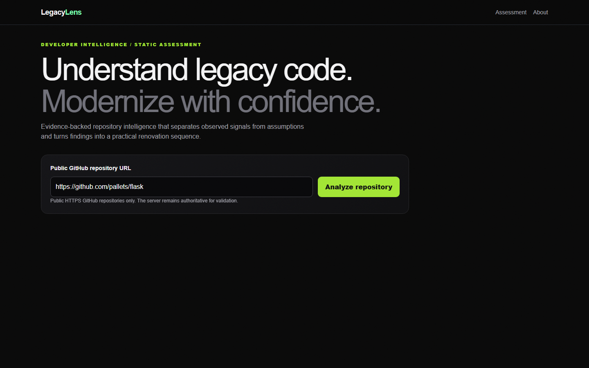
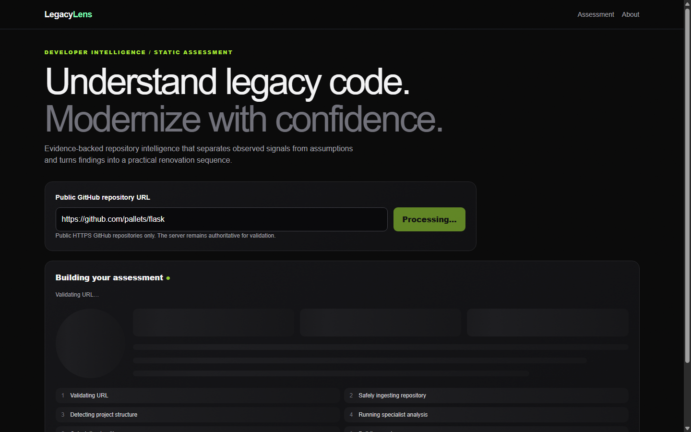
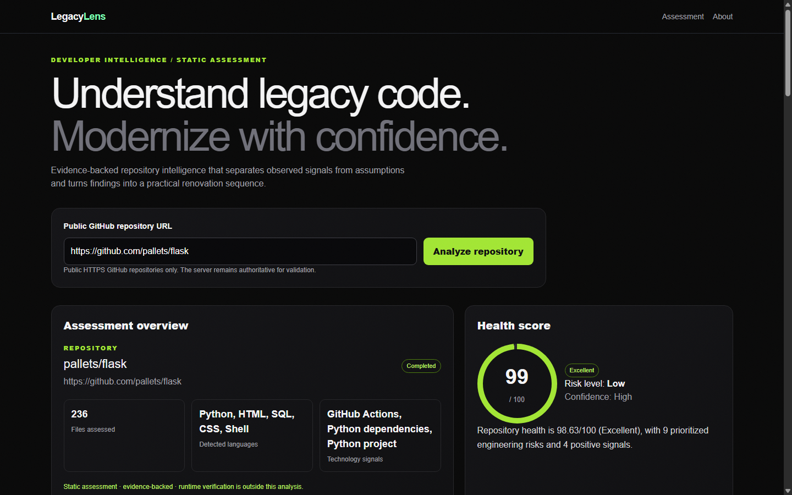
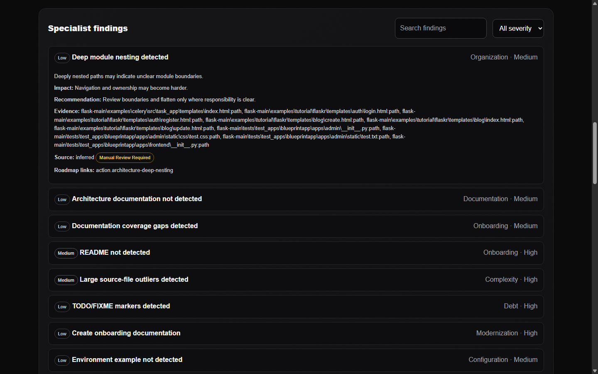
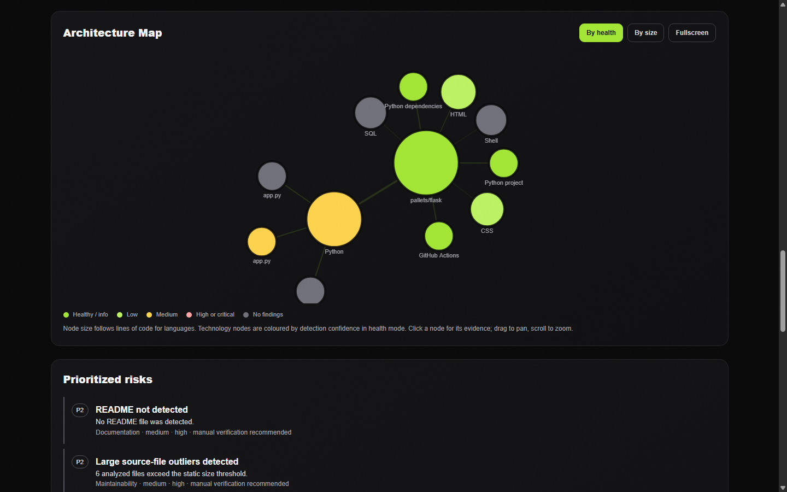
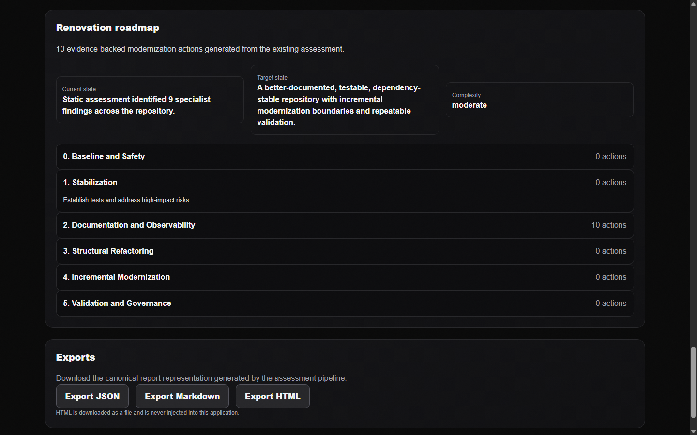
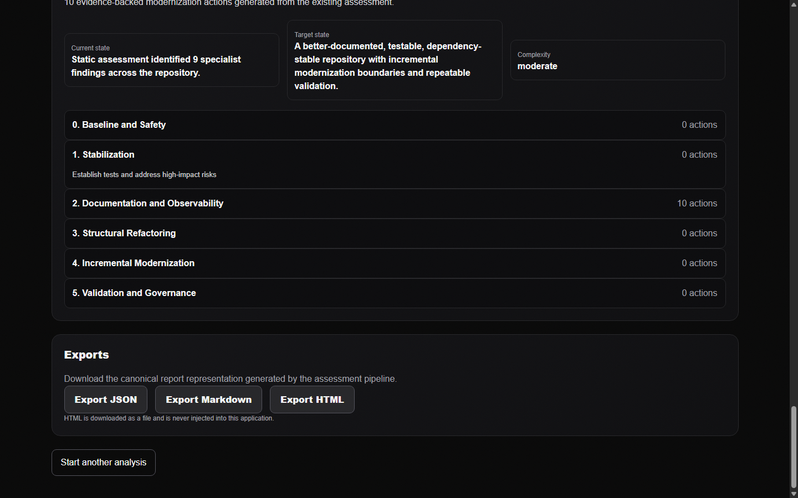

# LegacyLens — Evidence-backed repository intelligence

**LegacyLens turns a public GitHub repository into an evidence-backed modernization assessment: what is in the codebase, how healthy it is, which risks matter first, and what to renovate next — with every claim traceable to a file path.**

## The pitch

Before touching an inherited codebase, engineers burn hours answering the same questions: what is actually here, where are the fragile areas, what evidence supports that, and what should change first? LegacyLens automates that first investigation. It ingests a public GitHub repository safely, runs seven deterministic specialist analyzers over the extracted snapshot, scores seven weighted health categories, prioritizes risks P0–P3, and produces a six-phase renovation roadmap. Every finding carries its evidence references and an explicit source classification, so a heuristic signal is never presented as a confirmed defect. Nothing is executed: the repository is read, never run.

## Screenshots

| | |
|---|---|
|  |  |
| *01 — Landing page* | *02 — Repository input on `/analyze`* |
|  |  |
| *03 — Processing state with skeleton layout* | *04 — Assessment overview and health score* |
|  |  |
| *05 — Specialist findings with evidence* | *06 — Interactive architecture map* |
|  |  |
| *07 — Renovation roadmap phases and actions* | *08 — Canonical exports* |

All screenshots were captured from the running application analyzing `https://github.com/pallets/flask`.

## Architecture

**Backend:** FastAPI · safe ingestion · deterministic analysis · 7 specialists · weighted scoring · roadmap engine · canonical exports · SQLite (local/test) with PostgreSQL configuration for non-development environments.
**Frontend:** Next.js 15 (App Router) · React 19 · TypeScript · Tailwind CSS 3 · framer-motion · react-force-graph-2d for the architecture map.

```text
   GitHub repository URL (HTTPS, github.com/owner/repo only)
                        │
                        ▼
              ┌───────────────────┐
              │     Ingestion     │  URL validation, bounded archive
              │                   │  download, traversal-safe extract
              └─────────┬─────────┘  into a temporary workspace
                        ▼
              ┌───────────────────┐
              │  Deterministic    │  languages, technologies, metrics,
              │     Analysis      │  entry points, testing/doc signals
              └──────────────────┘
                        ▼
              ┌───────────────────┐
              │   7 Specialists   │  architecture · security · dependencies
              │                   │  testing · documentation ·
              │                   │  maintainability · modernization
              └─────────┬─────────┘
                        ▼
              ┌───────────────────┐
              │      Scoring      │  7 weighted categories, 0–100,
              │                   │  severity × confidence × evidence
              └──────────────────┘
                        ▼
              ┌───────────────────┐
              │      Roadmap      │  6 phases, P0–P3 actions, blockers,
              │                   │  quick wins, acceptance criteria
              └──────────────────┘
                        ▼
              ┌───────────────────┐        ┌──────────────────────┐
              │      Report       │───────▶│  Next.js dashboard   │
              │  (canonical JSON) │        │  + JSON/MD/HTML      │
              └───────────────────┘        │  export downloads    │
                                           └──────────────────────┘
```

The frontend renders the backend assessment exactly as returned; it never recomputes scores or invents findings.

## The seven specialists

| Specialist | What it measures |
|---|---|
| `architecture` | Entry-point concentration, deep module nesting, missing architecture documentation signals |
| `security` | Conservative configuration indicators (suspicious config filenames, missing `.env.example`, missing security docs) — not vulnerability scanning |
| `dependencies` | Missing lockfiles next to manifests and malformed/unparseable dependency manifests |
| `testing` | Absent test files and a test-to-source ratio below 0.1 |
| `documentation` | Missing README and per-category documentation coverage gaps |
| `maintainability` | Oversized source files (> 50 KB) and TODO/FIXME debt markers |
| `modernization` | Modernization readiness: reproducible dependencies, characterization tests, onboarding documentation |

Each finding reports `evidence_references` (file paths behind the claim) and a source classification, and the scoring engine down-weights inferred evidence relative to direct evidence.

## Scoring model

The overall health score is 0–100 and is the weighted sum of seven category scores:

| Category | Weight |
|---|---:|
| Architecture | 15% |
| Security | 20% |
| Dependencies | 15% |
| Testing | 15% |
| Documentation | 10% |
| Maintainability | 15% |
| Modernization readiness | 10% |

Each category starts at 100 and loses points per finding: `severity deduction × confidence factor × evidence-strength factor` (severity: info 0, low 3, medium 8, high 16, critical 28; confidence: high 1.0, medium 0.65, low 0.3; evidence: direct/verified 1.0, inferred 0.7, heuristic-with-manual-review 0.4). Verified positive signals add back up to 8 points, and every score is clamped to 0–100. Labels: ≥ 90 Excellent, ≥ 75 Healthy, ≥ 60 Needs Attention, ≥ 40 At Risk, below that Critical Attention. Risks are prioritized P0 (critical, high confidence, direct evidence) through P3. The dashboard's "Why this score?" panel exposes the same explanation, positive signals, and limitations returned by the backend.

## Renovation roadmap

The roadmap engine emits six fixed phases and places evidence-linked actions into them:

1. **Baseline and Safety** — establish a safe starting point before any change
2. **Stabilization** — critical/high findings and characterization-test baselines
3. **Documentation and Observability** — README, onboarding, and observability gaps
4. **Structural Refactoring** — reserved for structural work once stable
5. **Incremental Modernization** — reserved for staged modernization steps
6. **Validation and Governance** — reserved for verification and governance closure

Every action carries priority (P0–P3), effort (XS–XL), impact, risk, rationale, evidence references, prerequisites, expected outcome, acceptance criteria, and an automation-safety classification (`safe_to_automate`, `human_review_required`, or `do_not_automate`). Critical or high findings that require manual review — and security findings — additionally surface as explicit blockers. Quick wins are XS/S effort with low risk.

## Exports

Three canonical formats are generated server-side from the same report object the dashboard renders:

- **JSON** — the canonical machine-readable assessment
- **Markdown** — a portable engineering report
- **HTML** — a standalone document; every interpolated string is escaped, it references no external scripts, fonts, images, or CDNs, and it is **always downloaded as a file — it is never injected into the application**

Downloads use fixed filenames (`legacylens-assessment.json|md|html`) via `Content-Disposition: attachment`, and the frontend triggers them as blob downloads. The dashboard itself contains no `dangerouslySetInnerHTML`.

## Security model

- HTTPS-only repository URLs; the host must be exactly `github.com` with an `owner/repo` path.
- URLs containing credentials, custom ports, query strings, or fragments are rejected.
- Redirects are followed manually against an allowlist of `github.com`, `codeload.github.com`, and `objects.githubusercontent.com` (max 5 hops); anything else is rejected.
- Archive extraction rejects NUL bytes, absolute paths, drive letters, `..` segments, and symlink/hardlink entries, and verifies every resolved path stays inside the temporary workspace.
- Hard limits: 100 MB download, 10 MB per file, 250 MB total extracted, 10,000 files, 512-character paths, 30 s fetch timeout, 1 MiB request bodies.
- Repository code is never executed and dependencies from the inspected repository are never installed.
- In-process rate limiting: 60 requests per 60 s window per client IP and path, answered with `429` and `Retry-After`.
- CORS is restricted (default origin `http://localhost:3000`, credentials disabled, GET/POST only). Origins are matched exactly, so `http://127.0.0.1:3000` is a different origin and is rejected unless it is added to `CORS_ORIGINS`.
- Client-facing errors are sanitized to generic messages plus a request id; stack traces stay server-side.
- Security headers on every response: `X-Content-Type-Options: nosniff`, `X-Frame-Options: DENY`, `Referrer-Policy: no-referrer`, `Permissions-Policy`, `Cache-Control: no-store`.
- Exported HTML is escaped and self-contained; the frontend never injects HTML.

These are conservative safeguards for a static-analysis tool, not a claim that any analyzed repository is vulnerability-free.

## Built with IBM Bob 2.0

LegacyLens was developed inside the IBM Bob 2.0 agentic workflow: the project was decomposed into explicit engineering phases (ingestion security → deterministic analysis → specialists → scoring → roadmap → reporting → dashboard → hardening → submission prep), and each phase followed the same loop — inspect, implement, test, inspect results, document status, continue. Bob's planning, implementation, and review contexts were used for phase decomposition, targeted code changes with verification commands run after each one, and security-boundary review. Claims in this repository's documentation are limited to commands actually executed and behavior actually observed; LegacyLens itself does not call any IBM Bob runtime API or SDK. See `docs/BOB_WORKFLOW.md` for the project-specific record.

## Local setup (Windows)

### Backend

```bat
cd backend
python -m venv venv
venv\Scripts\activate
pip install -r requirements.txt
set APP_ENV=test
set DATABASE_URL=sqlite:///./legacylens.db
uvicorn app.main:app --host 127.0.0.1 --port 8000
```

Verify with `curl http://127.0.0.1:8000/api/v1/health`.

### Frontend

```bat
cd frontend
npm install
echo NEXT_PUBLIC_API_BASE_URL=http://127.0.0.1:8000/api/v1 > .env.local
npm run dev
```

Then open `http://localhost:3000`. Live GitHub analysis requires outbound network access from the machine running the backend.

Open the app through the `localhost` hostname, not `http://127.0.0.1:3000`. The backend's default CORS allowlist contains exactly `http://localhost:3000`, so an IP-based origin fails the preflight for `POST /api/v1/analyses` with `400` and the analysis never starts. If you must serve the frontend from a different origin, start the backend with `set CORS_ORIGINS=http://localhost:3000,http://127.0.0.1:3000` first.

## Environment variables

Backend (`backend/app/core/config.py`, pydantic-settings; all have defaults):

| Variable | Default | Purpose |
|---|---|---|
| `APP_NAME` | `LegacyLens` | Service name in responses |
| `APP_ENV` | `development` | Environment switch |
| `LOG_LEVEL` | `INFO` | Logging verbosity |
| `API_PREFIX` | `/api/v1` | API route prefix |
| `CORS_ORIGINS` | `http://localhost:3000` | Allowed browser origins (comma-separated) |
| `DATABASE_URL` | PostgreSQL DSN | Primary database for non-development environments |
| `SQLITE_DATABASE_URL` | `sqlite:///./legacylens.db` | Local/test database |
| `MAX_REQUEST_BODY_BYTES` | `1048576` | Request body cap (1 MiB) |
| `RATE_LIMIT_REQUESTS` / `RATE_LIMIT_WINDOW_SECONDS` | `60` / `60` | Rate limit per IP+path |
| `MAX_REPOSITORY_SIZE_MB` | `100` | Archive download cap |
| `MAX_FILE_SIZE_MB` | `10` | Per-file extraction cap |
| `MAX_TOTAL_EXTRACTED_SIZE_MB` | `250` | Total extraction cap |
| `MAX_FILE_COUNT` / `MAX_EXTRACTION_FILES` | `10000` / `10000` | File-count caps |
| `MAX_PATH_LENGTH` | `512` | Path length cap |
| `INGESTION_TIMEOUT_SECONDS` | `30` | Fetch timeout |

Frontend: `NEXT_PUBLIC_API_BASE_URL` (default fallback `http://localhost:8000/api/v1`). Never put backend secrets in `NEXT_PUBLIC_*` variables.

## API endpoints

| Method | Path | Purpose |
|---|---|---|
| `GET` | `/api/v1/health` | Service and database health (`status`, `version`, `database`) |
| `POST` | `/api/v1/repositories/ingest` | Safe ingestion of a validated GitHub URL into a temporary workspace |
| `POST` | `/api/v1/analyses` | Full pipeline: ingestion → analysis → specialists → scoring → roadmap → report (body: `{ "repository_url": "https://github.com/owner/repo" }`) |
| `POST` | `/api/v1/reports/export/json` | Canonical JSON report download |
| `POST` | `/api/v1/reports/export/markdown` | Canonical Markdown report download |
| `POST` | `/api/v1/reports/export/html` | Canonical standalone HTML report download |
| `GET` | `/docs` | FastAPI OpenAPI documentation |

Export endpoints accept the validated report object returned by the analysis pipeline; reports are request-scoped and there is no fake persistent report store.

## Tests

Backend regression suite — **31 tests passing** across analysis engine, specialists, scoring, ingestion security, URL validation, security headers, and report export behavior:

```bat
cd backend
python -m pytest -q
```

Frontend validation:

```bat
cd frontend
npx tsc --noEmit
npm run build
```

Browser-level behavior (analysis flow, architecture map interactions, 375 px responsive layout, reduced-motion rendering, zero console errors) is verified against the running application with a Chrome DevTools Protocol harness.

## Demo workflow

1. Start the backend and confirm `GET /api/v1/health` returns `ok`.
2. Start the frontend and open `http://localhost:3000`.
3. Paste a public repository, e.g. `https://github.com/pallets/flask`, and run the assessment.
4. Show the health score, risk level, and the "Why this score?" explanation with positive signals and limitations.
5. Filter and expand specialist findings; point at the evidence paths and source classification on each.
6. Open the architecture map: click a language node for its findings and category scores, switch By health / By size, and try fullscreen.
7. Walk the P0–P3 risks, then the roadmap phases with effort, prerequisites, and acceptance criteria.
8. Download the JSON, Markdown, and HTML exports and open the HTML file directly.

If network access is unavailable, use the deterministic local fixtures exercised by the backend test suite and label the demonstration as a fixture run — never present fixture output as a live GitHub analysis.

## Limitations

- Static analysis only: no runtime behavior, no DAST/SAST vulnerability scanning, no dependency installation or code execution.
- Findings are conservative indicators; several require manual review and are labeled as such.
- No automatic source-code rewriting is performed.
- Live GitHub ingestion requires outbound network access.
- Reports are request-scoped; there is no persisted report history.
- The fetched commit SHA is not pinned in responses in the current implementation.
- Rate limiting is in-process and intended for local/sandbox deployment, not horizontally scaled production.
- The architecture map caps display at 8 languages, 12 technologies, and 12 entry points and says so in the UI when items are hidden.

## License

MIT License — Copyright (c) 2026 AWAIS-EKREMAH

Permission is hereby granted, free of charge, to any person obtaining a copy of this software and associated documentation files (the "Software"), to deal in the Software without restriction, including without limitation the rights to use, copy, modify, merge, publish, distribute, sublicense, and/or sell copies of the Software, and to permit persons to whom the Software is furnished to do so, subject to the following conditions:

The above copyright notice and this permission notice shall be included in all copies or substantial portions of the Software.

THE SOFTWARE IS PROVIDED "AS IS", WITHOUT WARRANTY OF ANY KIND, EXPRESS OR IMPLIED, INCLUDING BUT NOT LIMITED TO THE WARRANTIES OF MERCHANTABILITY, FITNESS FOR A PARTICULAR PURPOSE AND NONINFRINGEMENT. IN NO EVENT SHALL THE AUTHORS OR COPYRIGHT HOLDERS BE LIABLE FOR ANY CLAIM, DAMAGES OR OTHER LIABILITY, WHETHER IN AN ACTION OF CONTRACT, TORT OR OTHERWISE, ARISING FROM, OUT OF OR IN CONNECTION WITH THE SOFTWARE OR THE USE OR OTHER DEALINGS IN THE SOFTWARE.

## Team

**AWAIS-EKREMAH**

- Awais Jabbar
- Muhammad Ekremah
